<h1 align="center">  
<h3 align="center">A Program that helps us in our presentation.</h3> 
  <h1 align="center">   
    <h3 align="center">Step1 &emsp;  &emsp; &emsp;  &emsp; &emsp;  &emsp; &emsp; &emsp; &emsp; &emsp; &emsp; &emsp; &emsp; &emsp; Step2 &emsp; &emsp; &emsp;  &emsp; &emsp;  &emsp; &emsp; &emsp;  &emsp; &emsp; &emsp; &emsp; &emsp; &emsp; &emsp;  Step3</h3> 
 <h1 align="center">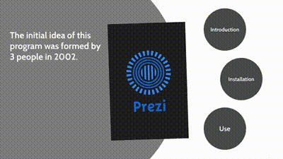 &emsp;
  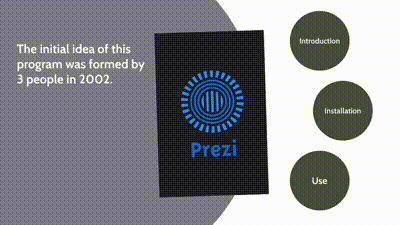 &emsp;
  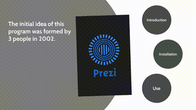  
   

     <h2 align="center">Introduction</h2>
   <h3 align="center">Prezi means presentation;  The initial idea of ​​Perzi was formed in 2002 by a group of 3 people in Hungary. Prezi presents with a new point of view, which causes the growth of this software.  In 2011, in addition to   Windows, Prezi was also released for iOS, which made it popular.</h3>  
    <h2 align="center">Prezi is used in the following two principles:</h2> 
    <h3 align="center">Education  &emsp; &emsp; &emsp; &emsp; &emsp; &emsp; &emsp; &emsp; &emsp; &emsp; &emsp; &emsp; &emsp; &emsp; &emsp; &emsp; &emsp; &emsp; &emsp; &emsp; &emsp; &emsp; &emsp; &emsp; Business</h3>
    <h1 align="center">  &emsp; &emsp; &emsp; &emsp; &emsp; &emsp;
     
   <h3 align="center">Despite all this, Prezi comes in two online versions that keep the presentations in your account dashboard and an offline version
     that is placed on your desktop and saves your presentations on your system.  One of the effective features of Prezi is video prezi,
    which produces a presentation from the slides you made,   the content you plan to present, and your image.
  </h3>  
  <h2 align="center">Companies and lectures that use Prezi:</h2> 
  <h1 align="center"> &emsp; &emsp;
    &emsp; &emsp;
     
   <h2 align="center">Comparison of Prezi and Powerpoint</h2>
 <h1 align="center">
 &emsp;&emsp; 
 &emsp; &emsp;    
 <h3 align="center"><li>One of the most important differences between them is that Perzi gives you freedom of movement according to your design and presentation, but the progress in the PowerPoint slides is linear and without creativity, which makes the viewer tired.<h3>
<h4 align="center"><li>Another advantage of Prezi compared to PowerPoint is that the format of the Prezi file is EXE and it can be run without installing the Prezi program, but PowerPoint must be purchased and installed.<h4>
  

   <h2 align="center">Installation</h2>
  <h5 align="center">Step1(Setup)</h5>
   <h1 align="center">
  <h5 align="center">Step2(Crack)</h5>
  <h1 align="center">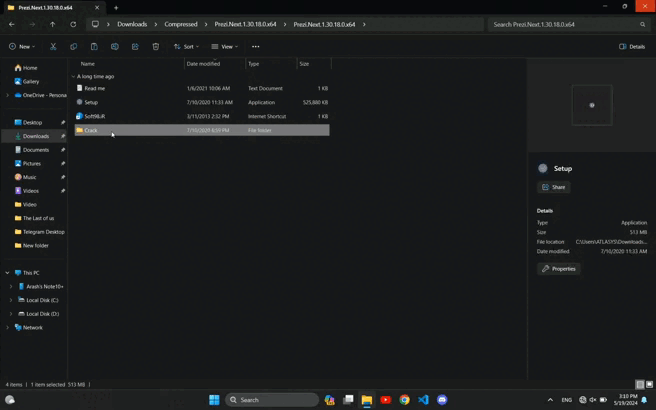
  <h5 align="center">Step3(Signup)</h5>
    <h5 align="center">www.prezi.com</h5>
  <h1 align="center">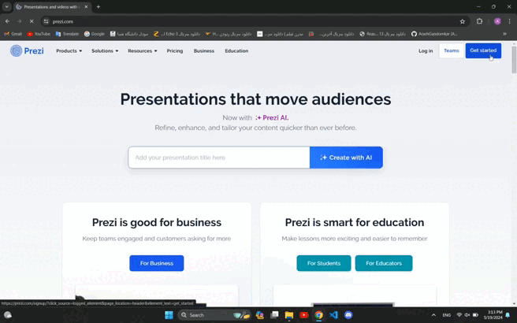
  <h5 align="center">Step4(Login)</h5>
  <h1 align="center">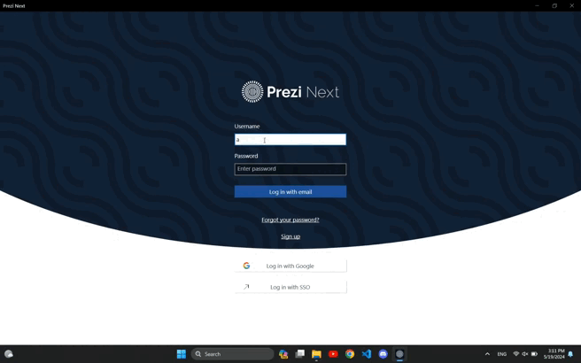
  <h5 align="center">Step5(Firewall)</h5>
  <h1 align="center">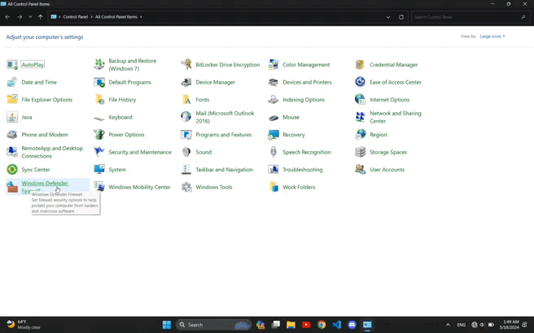
  <h5 align="center">Step6(New Rule)</h5>
  <h1 align="center">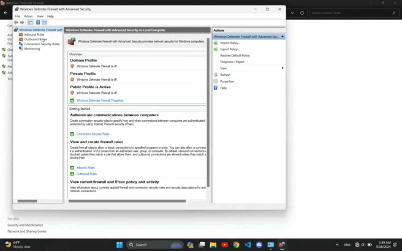
  

   <h2 align="center">How to use</h2>
  <h5 align="center">Create presentation</h5>
  <h1 align="center">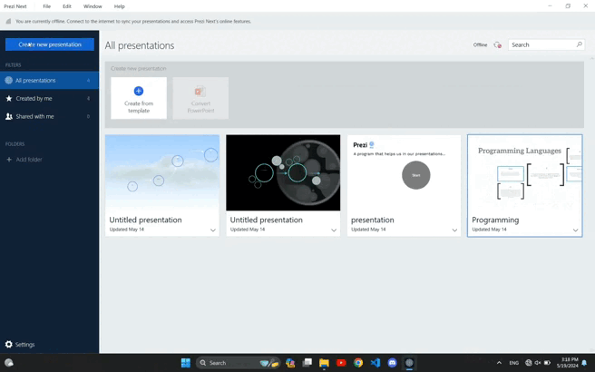
  <h5 align="center">Add topic</h5>
  <h1 align="center">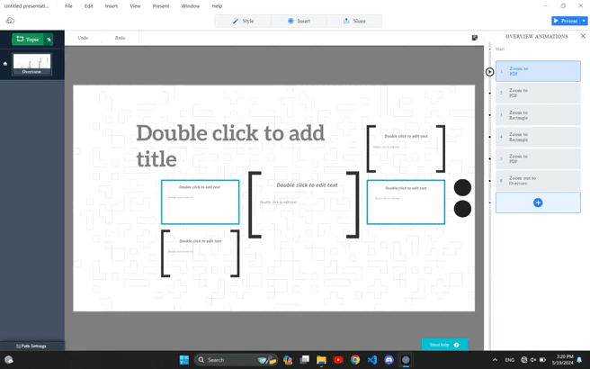
  <h5 align="center">Add animation</h5>
  <h1 align="center">
  <h5 align="center">Insert(Text,Image,..)</h5>
    <h1 align="center">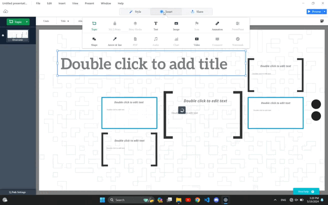
  <h5 align="center">Undo/Redo</h5> 
  <h1 align="center">
  <h5 align="center">Decrease size</h5>
    <h1 align="center">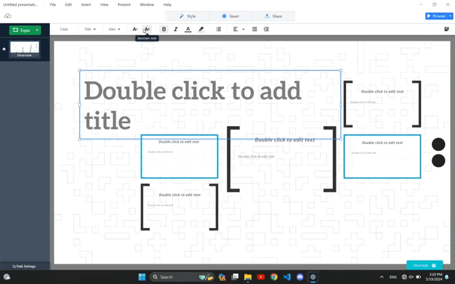
  <h5 align="center">Increase size</h5>
      <h1 align="center">
  <h5 align="center">Make Bold</h5>
        <h1 align="center">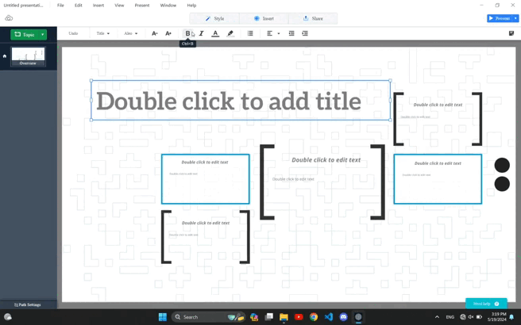
  <h5 align="center">Change to Italic</h5>
  <h1 align="center">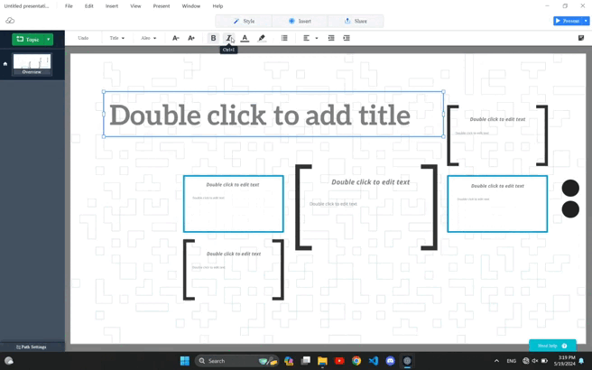
  <h5 align="center">Change color</h5>
  <h1 align="center">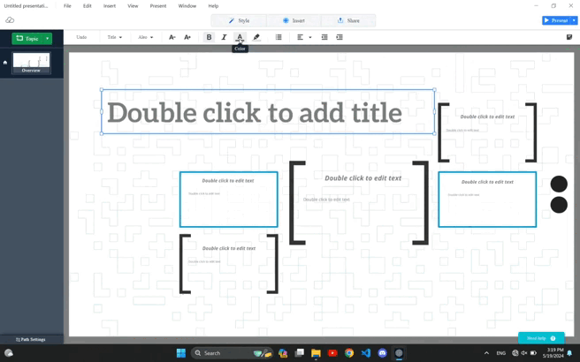
  <h5 align="center">Change background's color</h5>
  <h1 align="center">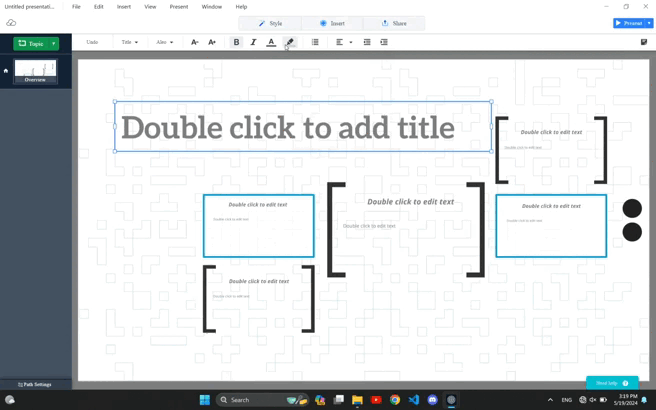
  <h5 align="center">Left/Center/Right</h5>
    <h1 align="center">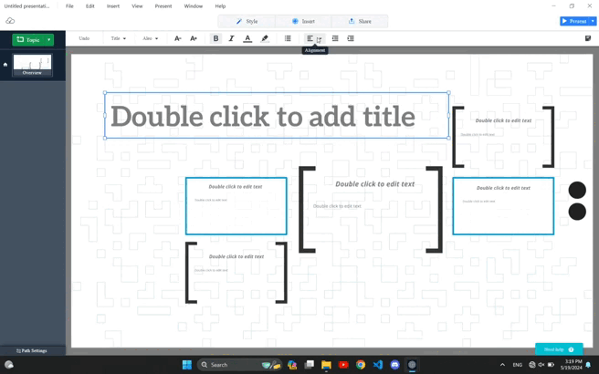
  <h5 align="center">Left indentation</h5>
      <h1 align="center">
  <h5 align="center">Right indentation</h5>
        <h1 align="center">
  <h5 align="center">Export file</h5>
  <h1 align="center">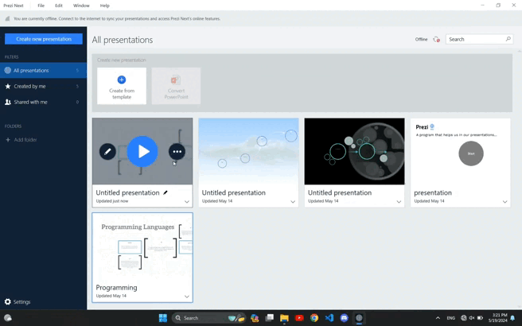
    <h5 align="center">Connect with me</h5>
  

<h4 align="center">Producted by Arash Gandomkar</h4>
